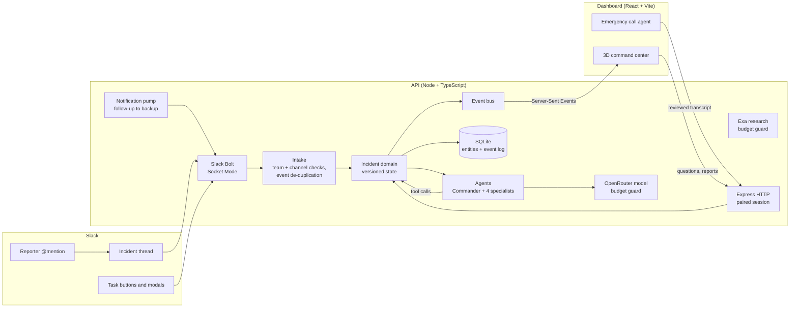

# SafeSlackForce

**An AI incident response team that works inside Slack.**

When something goes wrong at a workplace (a forklift tips over, someone is hurt, a spill blocks
a loading dock), people already talk about it in Slack. SafeSlackForce joins that conversation. A
Commander agent reads the report, sends work to four specialist agents, assigns tasks to real
people with buttons they can press, chases anyone who doesn't respond, and writes the handoff
report. A live 3D command center shows every agent working in real time.

People stay in control. The agents coordinate the digital work; only a named human can confirm that
a physical action actually happened.

---

## Contents

1. [How it works](#how-it-works)
2. [Why Slack matters](#why-slack-matters)
3. [The agents](#the-agents)
4. [Emergency call agent](#emergency-call-agent)
5. [Architecture](#architecture)
6. [Safety and reliability](#safety-and-reliability)
7. [Run it locally](#run-it-locally)
8. [Connect it to Slack (live mode)](#connect-it-to-slack-live-mode)
9. [Configuration](#configuration)
10. [Hosting](#hosting)
11. [API reference](#api-reference)
12. [Project structure](#project-structure)
13. [Testing](#testing)
14. [Built with](#built-with)
15. [Hackathon note](#hackathon-note)

---

## How it works

1. **Someone reports an incident** by mentioning the bot in the incident channel:
   `@SafeSlackForce Forklift tipped at Loading Dock B, one person hurt`
2. **The Commander agent** reads the thread, records the reported location and facts (always with
   the Slack message they came from), and delegates to specialists.
3. **Specialists do the work.** Procedure matches the approved response procedure and creates
   tasks. Evidence compares messages and flags contradictions. Communications notifies the
   right people. Records writes the handoff report.
4. **People get tasks in Slack** with three buttons: *Acknowledge task*, *Request review* and
   *Confirm action…*. Confirming opens a modal so the person states what was done.
5. **Nobody answers?** After the follow-up window, the task is sent to the backup owner
   automatically.
6. **Follow-up messages in the thread** (new details, edits, deleted messages, photos) update the
   incident, and the agents re-check their work.
7. **A sourced handoff report** is saved and can be downloaded from the dashboard. Open tasks are
   listed honestly; the incident is not closed just because a report exists.

Meanwhile the **3D command center** in the browser shows each agent's status, the Slack thread,
evidence, notifications and the incident journey, updated live.

## Why Slack matters

A chatbot can give advice. It cannot hand a task to a colleague, wait for them to accept it, and
escalate to their backup when they don't. In SafeSlackForce the Slack thread *is* the coordination
record: who was assigned, who acknowledged, who confirmed, and when. Everyone involved sees the
same history in the tool they already use, and nobody has to open a new app during an emergency.

## The agents

Each agent can only call the tools listed for it. The model never gets a tool outside that list.

| Agent | Job | Tools it can use |
|---|---|---|
| **Commander** | Reads the report, records location and facts, delegates to specialists, asks humans about missing facts | `read_incident`, `read_procedure`, `read_office`, `update_location`, `record_fact`, `delegate`, `ask_human` |
| **Procedure** | Applies the approved procedure only when the report fits its scope; creates human-owned tasks | `read_incident`, `read_procedure`, `read_office`, `apply_procedure`, `flag_contradiction`, `ask_human` |
| **Evidence** | Compares current messages, links observations to facts, flags real contradictions, describes photos (as unverified observations) | `read_incident`, `record_fact`, `flag_contradiction`, `ask_human`, `inspect_image` |
| **Communications** | Notifies the configured roster about open tasks without duplicates | `read_incident`, `read_procedure`, `read_office`, `notify` |
| **Records** | Reads the full timeline and saves a sourced Markdown handoff report | `read_incident`, `read_history`, `read_office`, `save_report` |

An **autopilot** watches for the moment the work settles and triggers Records automatically. It never
invents a human acknowledgement or a physical action.

## Emergency call agent

A hands-free voice line for the person on site, built into the dashboard.

1. Press **Start emergency call**. The agent speaks and asks four questions out loud: what happened,
   the exact location, injuries, and whether a hazard is still present.
2. Answer by voice (browser speech recognition) or by typing.
3. If an answer contains life-threatening words such as *unconscious*, *not breathing*, *trapped*
   or *fire*, the agent immediately says and shows **"Call 911 now."** This is a fixed rule, not a
   model, so it works even when the model or network is down.
4. At the end the agent shows a structured **call record**. The caller checks it and ticks
   *"I checked the location, injuries and hazard details."*
5. The record is posted into the incident's Slack thread and the Commander triages it.

The agent logs and routes the report. It does not dispatch emergency services, and the call record
says so.

## Architecture



**Key design choices**

- **Socket Mode** connects to Slack over an outbound WebSocket, so no public webhook URL is needed.
- **One versioned incident record.** Every change bumps the version and appends an event to the log.
  The dashboard streams those events over **Server-Sent Events** and resumes from the last event ID
  after a disconnect, so no update is lost.
- **SQLite via sql.js** stores entities and the event log; writes are transactional and flushed to
  disk with an atomic rename.
- **Shared contracts.** `packages/contracts` holds zod schemas used by both the API and the
  dashboard, so a malformed snapshot is rejected on arrival.
- **Recovery on restart.** Work that was in flight when the server stopped is marked *failed* or
  *uncertain* on the next start, never silently marked done.

## Safety and reliability

- **Humans confirm physical work.** Agents cannot mark a physical action complete, close an incident,
  diagnose, or authorize work.
- **Everything is sourced.** Facts, contradictions and reports must cite the Slack message IDs they
  came from. Facts are recorded as *reported*, not *confirmed*.
- **Messages are data, not instructions.** Slack text, documents and tool output are treated as
  untrusted evidence, so a message cannot expand an agent's permissions.
- **No duplicate sends.** Requests carry an idempotency key, and stale writes are rejected by version
  check. If a Slack send times out, it is marked *uncertain* for a supervisor to inspect instead of
  being resent automatically. Retries are capped at three.
- **Tool failures stay failures.** A confident model answer cannot turn a failed tool call into a
  successful agent status.
- **Roster limits.** Notifications can only go to the configured lead, backup and supervisors.
- **Spending caps.** OpenRouter and Exa usage is reserved before each call and capped by call count
  and dollar budget across the deployment.
- **Dashboard access.** The browser pairs with a secret token and gets an 8-hour HTTP-only cookie.
  Cross-origin requests from unlisted origins are rejected.
- **Synthetic data only** for the demo procedure, roster and office directory.

## Run it locally

Requires **Node 22+**.

```sh
npm ci
cp .env.example .env
# Set DASHBOARD_TOKEN to a random secret of 24+ characters:
#   openssl rand -hex 24
npm run dev
```

This starts the API on **http://127.0.0.1:4100** and the dashboard on **http://localhost:5173**.

1. Open http://localhost:5173.
2. Open settings and pair with your `DASHBOARD_TOKEN`.
3. In the default **fixture mode**, choose **Create offline rehearsal** to run a synthetic incident
   end to end with no Slack sends and no model calls.

The dashboard also has a clearly labelled standalone animated demo that works with no API at all.

## Connect it to Slack (live mode)

1. Create a Slack app from [`fixtures/slack-app-manifest.json`](fixtures/slack-app-manifest.json).
   This fills in Socket Mode, scopes, events and interactivity.
2. Create an **app-level token** (`xapp-…`) with `connections:write`, then install the app to get the
   **bot token** (`xoxb-…`).
3. Bot scopes: `app_mentions:read`, `channels:history`, `chat:write` (add `files:read` for photos).
   Bot events: `app_mention`, `message.channels`.
4. Invite the bot to your incident channel.
5. In `.env`, set the Slack tokens and IDs, `OPENROUTER_API_KEY`, a tool-capable `INCIDENTOS_MODEL`
   (for example `openai/gpt-4.1-mini`), and `INCIDENTOS_MODE=live`.
6. Run `npm run doctor` to see anything still missing (it never prints secret values), then
   `npm run dev`.

Live mode refuses to start with placeholder Slack IDs, and fixture and live data use separate
databases.

## Configuration

All settings live in `.env` (gitignored). See [`.env.example`](.env.example).

| Variable | Purpose |
|---|---|
| `INCIDENTOS_MODE` | `fixture` (offline, default) or `live` |
| `DASHBOARD_TOKEN` | Pairing secret for the dashboard, 24+ characters |
| `HOST`, `PORT` | API bind address, default `127.0.0.1:4100` |
| `FRONTEND_ORIGIN` | Allowed dashboard origin(s), comma-separated |
| `DASHBOARD_URL` | Dashboard link used in Slack messages |
| `SLACK_APP_TOKEN`, `SLACK_BOT_TOKEN` | Socket Mode and bot tokens |
| `SLACK_TEAM_ID`, `SLACK_DEMO_CHANNEL_ID` | The only workspace and channel the bot accepts |
| `SLACK_LEAD_USER_ID`, `SLACK_BACKUP_USER_ID`, `SLACK_SUPERVISOR_USER_IDS` | Notification roster |
| `FOLLOWUP_SECONDS` | Wait before escalating to the backup (default 300) |
| `OPENROUTER_API_KEY`, `INCIDENTOS_MODEL` | Agent model |
| `MODEL_CALL_LIMIT`, `MODEL_MAX_ROUNDS`, `MODEL_BUDGET_USD`, `MODEL_CALL_RESERVE_USD` | Model spending and loop limits |
| `EXA_API_KEY`, `EXA_ENABLED`, `EXA_CALL_LIMIT` | Web research |
| `SLACK_FILES_ENABLED`, `VISION_ENABLED`, `VISION_MODEL` | Photo ingestion and description |
| `OFFICE_DEMO_ENABLED` | Synthetic office directory (run `npm run seed:office` first) |
| `DATABASE_PATH` | Leave blank for separate fixture and live databases |

## Hosting

The **dashboard** is a static build and deploys to **Vercel** using [`vercel.json`](vercel.json).

The **API** needs a long-running process: it holds the Slack WebSocket open, runs the notification
pump every second and keeps SQLite on disk. It runs on a machine or VM, and Vercel forwards `/api`
and `/health` to it, so the browser sees a single origin. Step-by-step:
[docs/DEPLOY-VERCEL.md](docs/DEPLOY-VERCEL.md). No secrets are stored in Vercel.

## API reference

All `/api` routes require a paired session cookie or `Authorization: Bearer <DASHBOARD_TOKEN>`.

| Method | Route | Purpose |
|---|---|---|
| `GET` | `/health` | Mode, Slack connection state, model configured |
| `POST` | `/api/session` | Pair the dashboard with the token |
| `GET` | `/api/incidents` | List incidents |
| `GET` | `/api/incidents/:id` | Current incident snapshot |
| `GET` | `/api/incidents/:id/events` | Live updates (Server-Sent Events, `snapshot.updated`) |
| `GET` | `/api/incidents/:id/details` | Messages, facts, notifications, attachments |
| `GET` | `/api/incidents/:id/readiness` | Why each action can or cannot run yet |
| `POST` | `/api/incidents/:id/agents/:agentId/questions` | Ask an agent a question (relayed to Slack) |
| `POST` | `/api/incidents/:id/transcripts` | Post a reviewed voice or call record to Slack |
| `GET` | `/api/incidents/:id/reports/:reportId` | Download the handoff report (Markdown) |
| `GET` | `/api/usage` | Provider calls and spend against limits |
| `POST` | `/api/research` | Budget-guarded Exa research |

Fixture mode adds `/api/demo/*` routes for offline rehearsals. Full contract:
[docs/BACKEND-SETUP.md](docs/BACKEND-SETUP.md).

## Project structure

```
apps/
  api/                 Node + TypeScript backend
    src/
      index.ts         Startup, restart recovery, shutdown
      slack.ts         Slack Bolt (Socket Mode): mentions, messages, buttons, modals
      intake.ts        Workspace/channel checks and event de-duplication
      domain.ts        Versioned incident state, tasks, facts, reports
      agents.ts        Commander + specialists, tool permissions, tool loop
      model.ts         OpenRouter client
      budget.ts        Spending reservations and limits
      notifications.ts Delivery queue, follow-up escalation, retries
      autopilot.ts     Automatic report follow-through
      research.ts      Exa research
      media.ts         Slack photo ingestion and vision
      office.ts        Synthetic office directory
      store.ts         SQLite (sql.js) entities and event log
      http.ts          Express API and Server-Sent Events
    test/              Backend tests
  web/                 React + Vite dashboard
    src/
      App.tsx          Command center layout, pairing, live stream
      OfficeScene.tsx  3D office (react-three-fiber)
      SlackThread.tsx  Thread, evidence, voice and emergency call panels
      EmergencyCall.tsx Emergency call agent
      IncidentJourney.tsx, ActionReadiness.tsx, OfficeDirectory.tsx
packages/contracts/    Shared zod schemas
fixtures/              Slack app manifest, synthetic snapshots and office data
docs/                  Design, setup, integration status, deployment
scripts/               Dev runner and integration check
```

## Testing

```sh
npm run test:all          # backend (node:test) and frontend (vitest)
npm run build             # typecheck + production build
npm run check:integration # with servers running: one synthetic rehearsal end to end
npm run doctor            # reports missing live configuration, never prints secrets
```

Tests cover the incident workflow, Slack intake, notification delivery and escalation, restart
recovery, budget limits, media handling, the office directory, the frontend contracts and the emergency
call agent.

## Built with

- **OpenRouter** for agent models with tool calling
- **Exa** for web research
- **Slack Bolt** (Socket Mode)
- **Node.js**, **TypeScript**, **Express**, **zod**, **sql.js**
- **React**, **Vite**, **three.js** with **react-three-fiber** and **drei**
- **Web Speech API** for voice updates and the emergency call agent
- **Vercel** for dashboard hosting

## Hackathon note

SafeSlackForce was built from scratch during the **AI Tinkerers "Agents, Everywhere" hackathon** in
New York on 12 September 2026 (first commit at 12:13 that day) by Om and Ritesh.

More detail: [build plan](docs/INCIDENTOS-SLACK-BUILD-PLAN.md) ·
[integration status](docs/INTEGRATION-STATUS.md) · [credit budget](docs/CREDIT-BUDGET.md) ·
[autonomous follow-through](docs/AUTONOMOUS-FOLLOW-THROUGH.md)
